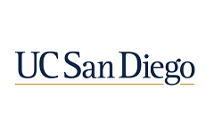

# Owen Pan

## Who are you?

Hi! I'm ***Owen***, a ~~first-year~~ **_second-year_ student** at **UC San Diego** majoring in *Mathematics-Computer Science*.



## Math-CS? How much CS does that involve?

Quite a bit, actually. Per the [major description](20-21-MA30.png):

> Graduates of this program will be mathematically oriented computer scientists who have specialized in the mathematical aspects and foundations of computer science or in the computer applications of mathematics.

So while it is a Math major, the mathematical subjects focused on are highly relevant in the field of computer science.

## That's all theoretical stuff, though. Can you write code?

Of course! Check this out.

```python
print("Hello, World!")
```

All jokes aside, the curriculum doesn't just consist of courses focused on abstract theoretical mumbo jumbo. There are quite a few courses aren't focused on the theoretical aspects of computer science, such as

- Software Tools and Techniques Laboratory (CSE 15L)
- Computer Organization and Systems Programming (CSE 30)
- Computer Implementations of Data Structures (CSE 100)

Obviously, there is still a lot of focus on math. More info about that [here](https://math.ucsd.edu/_files/undergraduate/undergraduate-resources/advising-presentations/Majors-Mathematics-ComputerScience-20170501.pdf).

## Okay. So why'd you choose Math-CS?

For two main reasons:

1. I've been interested in math for even longer than I have been with CS.
2. The mathematical subjects covered really help with understanding many CS concepts.

## Alright, but who are you?

See [Who are you?](#who-are-you).

## TODO

- [x] Use all of the core Markdown constructs
- [x] Add some pictures
- [x] Proofread
- [ ] Remove this TODO section
